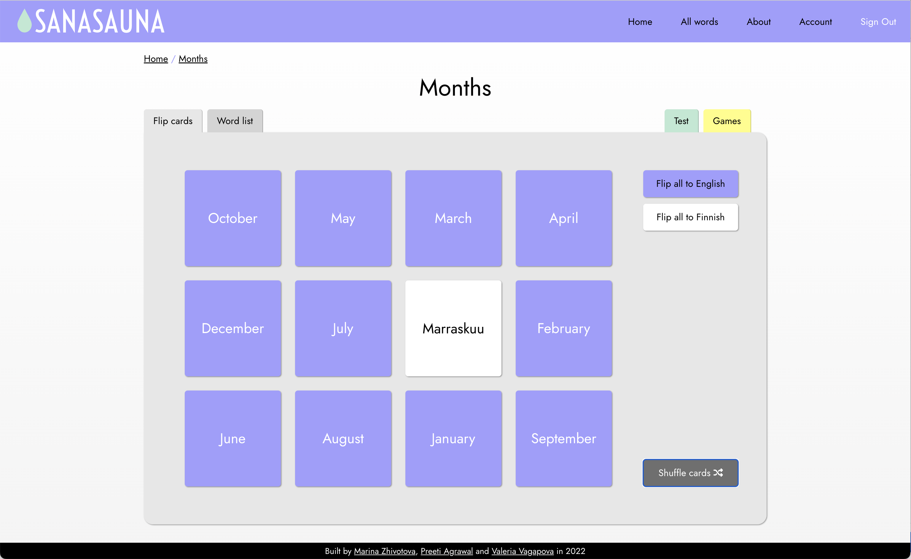

# Sanasauna!

Web app to help you learn those Finnish words.

## About the project

Team project created in December 2022 with [@preetiag18](https://github.com/preetiag18) and [@marinezh](https://github.com/marinezh) as a part of Full Stack Web Development course at Business College Helsinki.

### Technologies used

- Node.js
- Express
- React
- Axios

## How to run

Clone the repo and set up the project:

### Backend

- cd into /server
- `npm install`
- `node wordsServer`
- server will start running on port 3001 (change port in storage/serverConfig.json if needed)

### Frontend

- cd into /client
- `npm install`
- `npm start`
- Open `localhost:3000` in a browser of your choice
